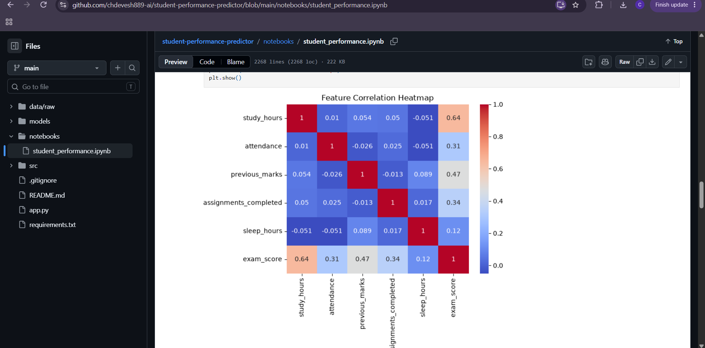
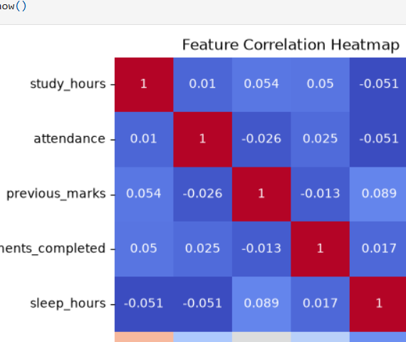
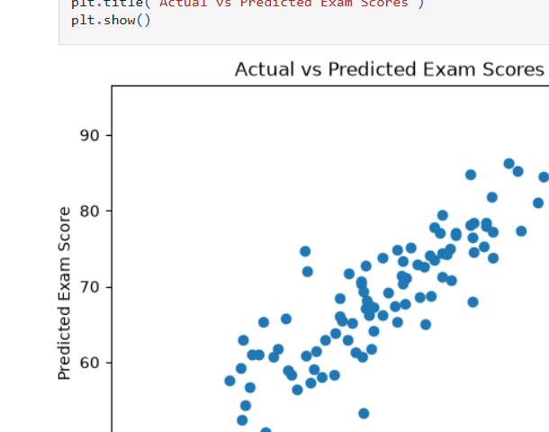

# 🎓 Student Performance Predictor

An end-to-end machine learning project that predicts a student's exam score based on academic and lifestyle factors using **Linear Regression**.

---

## 📌 Project Overview

The goal of this project is to predict a student's expected exam score based on the following factors:

- 📚 Study Hours
- 🏫 Attendance Percentage
- 📝 Previous Marks
- ✅ Assignments Completed
- 😴 Sleep Hours

### Machine Learning Workflow

```text
Data Generation
      ↓
Exploratory Data Analysis
      ↓
Feature & Target Separation
      ↓
Train/Test Split
      ↓
Model Training
      ↓
Model Evaluation
      ↓
Model Serialization
      ↓
Reusable Prediction Module
      ↓
Streamlit Web Application


### ⚠️ Important

Notice that we have **two different types of code blocks** here.

The outside block is Markdown:

````markdown
```markdown
...


But inside the README, the workflow itself is:

````markdown
```text
Data Generation
...
```

---

## 🧠 Machine Learning Approach

### Problem Type

**Supervised Learning → Regression**

The target variable, `exam_score`, is a continuous numerical value. Therefore, this is a regression problem.

### Algorithm

**Linear Regression**

The model learns the relationship between the input features and the student's exam score.

---

## 📊 Dataset

The dataset contains **500 student records** with:

- **5 input features**
- **1 target variable**

### Input Features

| Feature | Description |
|---|---|
| `study_hours` | Number of hours spent studying |
| `attendance` | Student attendance percentage |
| `previous_marks` | Marks obtained in previous examinations |
| `assignments_completed` | Number of completed assignments |
| `sleep_hours` | Average number of hours of sleep |

### Target Variable

`exam_score` — the student's examination score.

> **Note:** The dataset is synthetically generated for educational and demonstration purposes. It is not collected from real students.

---

## 🔍 Exploratory Data Analysis

The project uses **Pandas, NumPy, Matplotlib, and Seaborn** for data analysis and visualization.

### Study Hours vs Exam Score

The scatter plot shows the relationship between study hours and exam scores.

The generated dataset shows a positive relationship, where students with higher study hours generally tend to have higher predicted exam scores.



### Feature Correlation Heatmap

The correlation heatmap shows the linear relationships between the numerical features in the dataset.

In this synthetic dataset, `study_hours` has the strongest correlation with `exam_score`.



> **Important:** Correlation indicates a statistical relationship between variables. It does not prove causation.

---

## ⚙️ Model Training

The dataset was divided into:

- **80% training data**
- **20% testing data**

A **Linear Regression** model from Scikit-learn was trained using the training dataset.

The trained model was serialized using **Joblib** and saved as:

```text
models/student_performance_model.pkl


---

#  Model Evaluation

Paste:

```markdown
---

## 📈 Model Evaluation

The trained model was evaluated on the unseen test dataset using the following regression metrics:

- Mean Absolute Error (MAE)
- Mean Squared Error (MSE)
- Root Mean Squared Error (RMSE)
- R² Score

### Evaluation Results

| Metric | Score |
|---|---:|
| MAE | 3.80 |
| MSE | 25.56 |
| RMSE | 5.06 |
| R² Score | 0.785 |

### Understanding the Results

#### MAE — 3.80

The model's predictions differ from the actual exam scores by approximately **3.8 marks on average**.

#### MSE — 25.56

Mean Squared Error calculates the average of the squared differences between actual and predicted values.

#### RMSE — 5.06

Root Mean Squared Error measures prediction error in the same unit as the target variable, while giving greater importance to larger errors.

#### R² Score — 0.785

The model explains approximately **78.5% of the variation** in exam scores on the test dataset.

> **Note:** R² is not classification accuracy. This project is a regression problem.

---

## 🎯 Actual vs Predicted Exam Scores

The following visualization compares the actual exam scores from the test dataset with the scores predicted by the trained Linear Regression model.

A prediction closer to the diagonal relationship indicates that the predicted value is closer to the actual value.

---

## 🎯 Actual vs Predicted Exam Scores

The following visualization compares the actual exam scores from the test dataset with the scores predicted by the trained Linear Regression model.

A prediction closer to the diagonal relationship indicates that the predicted value is closer to the actual value.



---

## 🌐 Streamlit Application

The trained machine learning model is integrated into a **Streamlit web application**.

The application allows users to enter student information and receive a predicted exam score without directly interacting with the machine learning code.

### Example Input

```text
Study Hours: 8
Attendance: 85%
Previous Marks: 75
Assignments Completed: 8
Sleep Hours: 7

Predicted Exam Score: 82.99

```markdown
---

## 🏗️ Project Structure

```text
student-performance-predictor/
│
├── app.py
│
├── data/
│   ├── raw/
│   │   └── student_data.csv
│   └── processed/
│
├── models/
│   └── student_performance_model.pkl
│
├── notebooks/
│   └── student_performance.ipynb
│
├── screenshots/
│   ├── actual_vs_predicted.png
│   ├── correlation_heatmap.png
│   ├── streamlit_app.png
│   └── study_hours_vs_score.png
│
├── src/
│   └── predict.py
│
├── .gitignore
├── README.md


## 🛠️ Technologies Used

- **Python** — Programming language
- **NumPy** — Numerical computing
- **Pandas** — Data manipulation and analysis
- **Matplotlib** — Data visualization
- **Seaborn** — Statistical visualization
- **Scikit-learn** — Machine learning
- **Joblib** — Model serialization
- **Streamlit** — Web application
- **Jupyter Notebook** — Experimentation and analysis
- **Git & GitHub** — Version control

## 🚀 How to Run Locally

### 1. Clone the Repository

```bash
git clone https://github.com/chdevesh889-ai/student-performance-predictor.git

Navigate into the project:

cd student-performance-predictor
2. Create a Virtual Environment
python -m venv .venv
3. Activate the Virtual Environment

For Windows PowerShell:

.venv\Scripts\Activate.ps1
4. Install Dependencies
pip install -r requirements.txt
5. Run the Streamlit Application
streamlit run app.py

The application will open in your browser at the local Streamlit address.

## 💡 Key Learning Outcomes

Through this project, I practiced:

- Creating and understanding a machine learning dataset
- Exploratory Data Analysis (EDA)
- Understanding features and target variables
- Feature-target relationship analysis
- Correlation analysis
- Data visualization
- Train/test splitting
- Training a Linear Regression model
- Making predictions on unseen data
- Evaluating regression models
- Understanding MAE, MSE, RMSE, and R²
- Saving and loading trained ML models
- Writing reusable prediction logic
- Building a Streamlit ML application
- Managing Python virtual environments
- Managing project dependencies with `requirements.txt`
- Using Git for version control
- Publishing an ML project on GitHub

## 🔮 Future Improvements

Possible improvements for future versions include:

- Use a real-world student performance dataset
- Add more student-related features
- Compare multiple regression algorithms
- Perform hyperparameter tuning
- Implement cross-validation
- Add model explainability
- Improve input validation
- Improve the Streamlit user interface
- Deploy the application online
- Monitor model performance on new data

## ⚠️ Limitations

- The dataset is synthetically generated and may not represent real-world student behavior.
- The model is intended for educational and demonstration purposes.
- The prediction should not be used for real academic decisions.
- Model performance may change significantly when trained on real-world data.
- Linear Regression assumes a linear relationship between the input features and target variable.

## 👨‍💻 Author

**Ch Devesh**

Built as part of my AI/ML learning journey.

---

⭐ If you found this project useful, feel free to explore the repository and follow my learning journey.